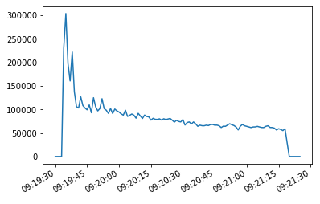
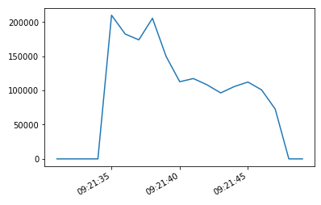
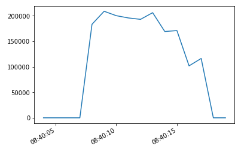

# Problem 4

Add your findings and least one visualization for each measurement (e.g., the goodput over time).
Explain what you tried to optimize and evaluate its effects.

a) Goodput test

In the following figure, we can see the goodput over time printed using matplotlib:

b) Optimization

For optimization, I saw some improvement when setting the initial_max_streams_bidi transport parameter to a higher value (in our case 255), similar to how we have done in testcase "transportparameter":

# Problem 5
a) Did you like/dislike our git/CI infrastructure setup? 

I really liked the overall setup.

b) Do you have a feature request for our git/CI infrastructure?

I didn't really like that artifacts were disabled if a job failed as this is exactly when you want to take a look at the artifacts. I made some changes to the CI file in the first week so artifacts are also enabled if the overall job fails, feel free to use some of my changes if you want to.

c) How was your experience with the Interop Runner? Did you look at the provided code and repository? Did you execute the code on your own or did you rely on the CI?

The experience was really good. It's cool that we're using a tool for our implementation that's also used in the "real world" to test QUIC implementations. I also executed the code on the VMs for easier debugging.

d) Did you analyze your implementation in comparison to other submissions? Was the offered result matrix interesting or helpful?

Yes I did. Unfortunately due to time constraints in the last weeks (my first exam is on the 8th of February already) not as much as I would've liked to, but it was still really cool to see how my implementation is comparing to others.

e) How much time did you spend on each problem?

* Problem 1: 2 hours
* Problem 2: 20 hours (I had some library specific issues)
* Problem 3: 6 hours
* Problem 4: 3 hours

f) Was the project too easy/too difficult/just right?

Just right

g) What did you like/dislike about the project?

/

h) What would you do to improve the project?

See b)

i) Which library did you use for the project? How good was the documentation and your experience with the code? What were the major technical issues you faced regarding your selected library?

I used [h3](https://github.com/hyperium/h3) for my HTTP/3 implementation, and [quinn](https://github.com/quinn-rs/quinn) as the underlying QUIC implementation. Overall, I'm really happy that I opted for those libraries, as I quite enjoy coding in Rust. A major issue was that h3 is still experimental, and it's only planned to be used as an internal dependency of [hyper](https://github.com/hyperium/hyper). This means, documentation is still incomplete, and the library also not published yet, so building gets a little bit more complicated (see my setup using git submodules).

